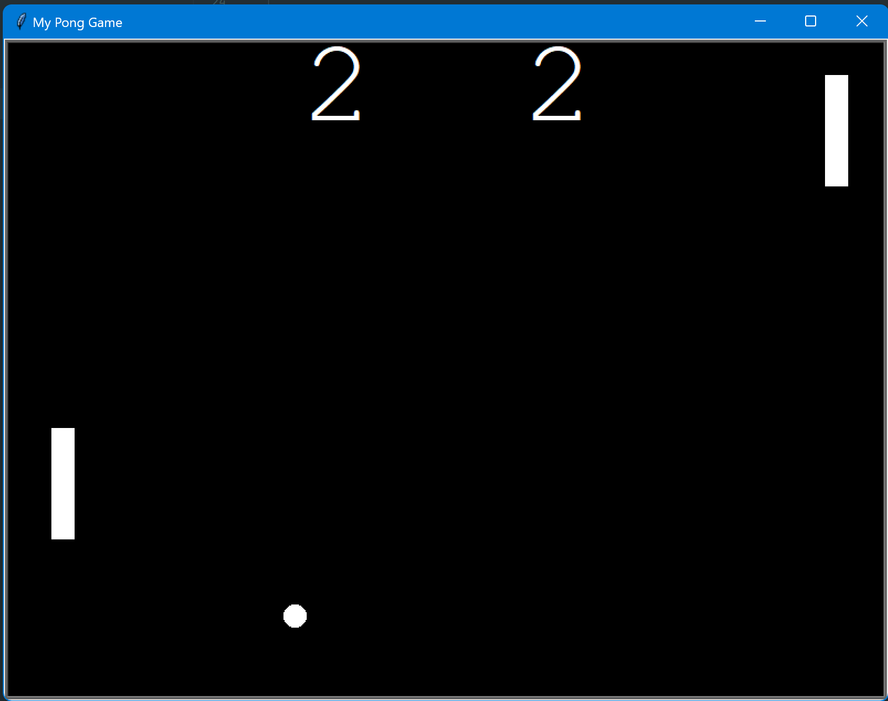

# Pong Game in Python

## Project for day 22 of 100 days of code Python Bootcamp

### To play:
  - you need to have python 3 installed on your machine
  - download the repository
  - open terminal in the pong_game folder and run `python main.py`
  - left paddle moves with "w" and "s", right paddle moves with arrow keys on your keyboard
